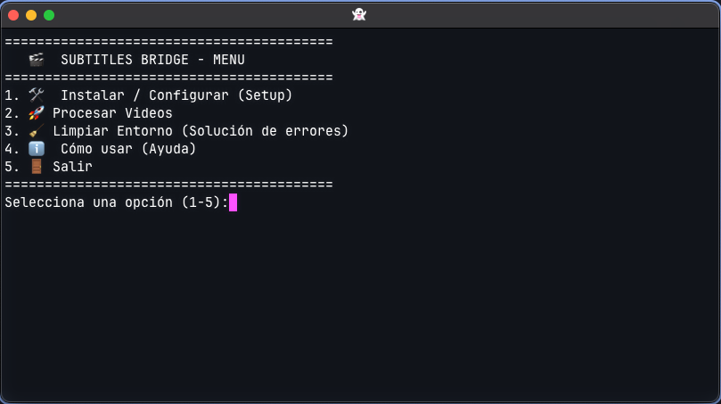

# Subtitles Bridge

CLI personal para convertir subtítulos existentes o generados en pistas
seleccionables dentro de un video nuevo.



## Objetivo

Dada una carpeta con uno o más videos:

1. inspeccionar cada MP4 o MKV y sus subtítulos asociados;
2. reutilizar todos los subtítulos válidos encontrados;
3. ejecutar Whisper solamente si no existe ningún subtítulo;
4. generar, en ese caso, un único SRT en el idioma hablado;
5. crear un MKV nuevo con todas las pistas seleccionables;
6. verificar que ningún stream del original se haya perdido o recodificado;
7. mover automáticamente el original y los sidecars utilizados a `trash/`.

El programa no elimina definitivamente archivos. `trash/` es una cuarentena
local para que el usuario revise y borre manualmente lo que ya no necesite.

## Garantías del flujo objetivo

- Se aceptan inicialmente videos `.mp4` y `.mkv`, sin recorrer subcarpetas.
- Todos los subtítulos válidos asociados se incorporan, sin limitar idiomas.
- La existencia de cualquier subtítulo válido evita una transcripción nueva.
- No se traduce automáticamente para completar inglés o español.
- Video, audio y demás streams se copian sin compresión ni recodificación.
- Se conservan todos los audios y sus disposiciones originales.
- Ningún subtítulo queda seleccionado por defecto.
- Nada se mueve a `trash/` antes de verificar y publicar el MKV final.
- No se sobrescriben salidas ni archivos archivados.

Remultiplexar a MKV cambia el contenedor, no la calidad de audio o video. MKV
se eligió porque VLC lo reproduce correctamente y ofrece flexibilidad para
múltiples pistas.

## Estructura esperada

Entrada:

```text
videos/
├── lesson-01.mp4
├── lesson-01.en.srt
└── lesson-01.es.srt
```

Después de una ejecución exitosa:

```text
videos/
├── output/
│   └── lesson-01.subtitled.mkv
└── trash/
    └── lesson-01/
        ├── lesson-01.mp4
        ├── lesson-01.en.srt
        └── lesson-01.es.srt
```

## Estado del proyecto

El contrato funcional está documentado, pero todavía no está implementado. El
código actual es un prototipo anterior que:

- procesa únicamente MP4;
- genera un SRT inglés con Whisper;
- lo traduce al español mediante Google;
- no crea aún el MKV final ni ejecuta la verificación y el archivado acordados.

Por tanto, el menú actual no debe interpretarse como la experiencia final ni
usarse todavía para confiarle el movimiento de archivos importantes.

La implementación avanzará en fases pequeñas: pruebas, núcleo modular,
preflight, generación condicional, remux, verificación y cuarentena.

## Requisitos previstos

- Python 3.10 o posterior;
- FFmpeg y FFprobe;
- OpenAI Whisper para el caso sin subtítulos;
- macOS como primera plataforma validada.

El núcleo se mantendrá portable a Linux y Windows. Los scripts shell podrán
facilitar la instalación o el uso interactivo, pero la lógica principal y la
CLI estarán implementadas en Python.

## Código existente

- `menu.sh`: menú interactivo del prototipo.
- `setup.sh`: instalación del entorno actual.
- `process_videos.py`: orquestación monolítica del flujo anterior.
- `local_translate_srt.py`: traducción remota del flujo anterior.
- `tools/normalize_video_mp4/`: utilidad independiente importada para estudiar
  FFprobe, FFmpeg y metadata; no define el contenedor final del nuevo pipeline.

## Documentación

- [`docs/PROJECT.md`](docs/PROJECT.md): objetivo, alcance y decisiones.
- [`docs/WORKFLOW.md`](docs/WORKFLOW.md): preflight, matriz y transacción por
  video.
- [`BACKLOG.md`](BACKLOG.md): fases, orden y criterios de aceptación.

Las decisiones de producto se documentan antes de cambiar comportamiento.
