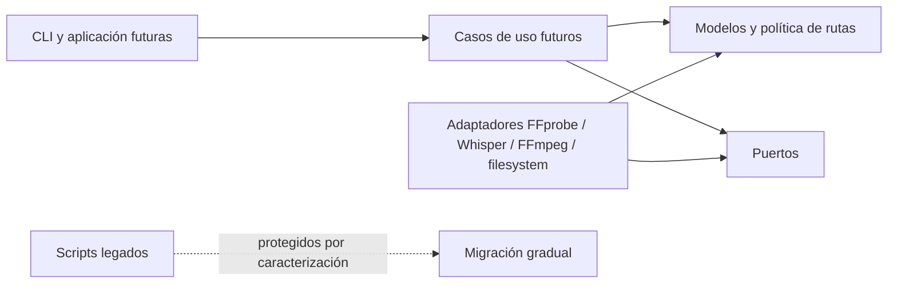

# Arquitectura del núcleo Python

Este documento fija los límites técnicos introducidos en P0.2. Complementa el
contrato funcional de [`PROJECT.md`](PROJECT.md) y [`WORKFLOW.md`](WORKFLOW.md),
pero no adelanta el comportamiento de las fases posteriores.

## Objetivo de P0.2

Crear un núcleo importable, portable y comprobable que permita incorporar el
nuevo pipeline sin seguir ampliando los scripts monolíticos existentes.

P0.2 define:

- modelos inmutables para streams, subtítulos, inventarios, planes y resultados;
- la política pura de rutas `output/` y `trash/`;
- errores propios del proyecto;
- puertos tipados para aislar herramientas y efectos externos.

P0.2 no implementa todavía:

- descubrimiento o asociación de archivos;
- ejecución de FFprobe, Whisper o FFmpeg;
- planner funcional;
- validación SRT;
- verificación, publicación o movimientos reales;
- CLI nueva ni integración con `menu.sh`.

Esas responsabilidades se agregan en P0.3 y fases posteriores detrás de los
límites definidos aquí.

## Dirección de dependencias



- Los modelos no importan adaptadores ni scripts.
- Los puertos dependen de modelos, no de implementaciones concretas.
- Los futuros adaptadores dependen hacia adentro de modelos y puertos.
- La aplicación futura coordina puertos; no invoca `subprocess` directamente.
- `menu.sh` podrá llamar a la CLI, pero nunca contendrá la única lógica.

## Paquete `subtitles_bridge`

| Módulo | Responsabilidad |
| --- | --- |
| `errors.py` | Excepciones accionables del núcleo y de rutas de entrada. |
| `models.py` | Tipos de dominio inmutables y sus invariantes locales. |
| `paths.py` | Resolver el workspace y derivar salidas sin crear ni mover archivos. |
| `ports.py` | Protocolos para inspección, transcripción, mux, verificación, publicación y archivado. |

No se crean módulos vacíos para las fases futuras. Cada adaptador o caso de uso
aparecerá cuando exista comportamiento y pruebas que lo justifiquen.

## Invariantes iniciales

- Los índices de stream son no negativos y únicos por inventario.
- Codec e idioma nunca se representan con cadenas vacías; un idioma desconocido
  usa `und`.
- Un subtítulo externo o generado referencia un archivo.
- Un subtítulo embebido referencia un índice de stream.
- Cada etapa aparece como máximo una vez en un plan.
- Una fuente administrada pertenece al nivel principal del workspace y es MP4
  o MKV.
- Derivar rutas no crea `output/`, `trash/` ni staging.

## Relación con el prototipo

`process_videos.py`, `local_translate_srt.py` y
`tools/normalize_video_mp4/normalize_video_mp4.py` permanecen sin cambios en
P0.2. El paquete nuevo no los importa. Sus pruebas de caracterización continúan
protegiendo el comportamiento conocido mientras las siguientes fases extraen o
reemplazan responsabilidades gradualmente.

## Extensión P0.3: inventario read-only

P0.3 agrega componentes concretos detrás de los límites del núcleo:

| Módulo | Responsabilidad |
| --- | --- |
| `languages.py` | Normalización conservadora de metadata conocida. |
| `srt.py` | Decodificación y validación estructural de SRT sin reescribirlos. |
| `adapters/ffprobe.py` | Ejecución inyectable de FFprobe y mapeo JSON a modelos. |
| `discovery.py` | Videos, sidecars, asociación exacta e inventario por workspace. |

El servicio de discovery recibe los puertos de inspección y validación. Devuelve
inventarios e incidencias; no decide qué etapas ejecutar. Los SRT ambiguos o no
asociados quedan fuera de todos los inventarios, mientras que un SRT inválido
con asociación inequívoca permanece registrado como `invalid` para explicar el
estado observado.

La implementación no crea directorios ni modifica insumos. Planner, generación,
mux, verificación y archivado continúan fuera de P0.3.

## Extensión P0.4: planificación y resumen

P0.4 agrega tres componentes puros sobre los inventarios existentes:

| Módulo | Responsabilidad |
| --- | --- |
| `planner.py` | Aplicar la matriz por video y resolver el audio inequívoco. |
| `batch_planner.py` | Propagar incidencias y detectar colisiones entre destinos del lote. |
| `summary.py` | Convertir planes e incidencias en un resumen previo determinista. |

El planner recibe `DiscoveryResult`, política de rutas y elecciones explícitas.
No consulta Whisper, FFmpeg ni backends de traducción, y no crea, renombra o
mueve archivos. Discovery aporta la existencia de destinos administrados; una
salida solo se considera válida cuando el llamador la marca como verificada.
Así se mantiene separado el razonamiento read-only de la verificación real que
se implementará en P0.7.

`BatchPlan` conserva todos los planes por video y las incidencias globales. Un
plan con cualquier decisión `needs-input`, o un lote con incidencias de
discovery sin resolver, no es ejecutable. Esta propiedad será la barrera que
las futuras capas de aplicación deberán comprobar antes de iniciar etapas con
efectos.

## Extensión P0.5: transcripción local en staging

P0.5 agrega tres responsabilidades detrás de puertos inyectables:

| Módulo | Responsabilidad |
| --- | --- |
| `adapters/ffmpeg_audio.py` | Extraer únicamente el stream elegido a PCM temporal sin tocar la fuente. |
| `adapters/whisper.py` | Resolver un modelo local e invocar la API Python de Whisper con `task=transcribe`. |
| `transcription.py` | Respetar el plan, coordinar staging, renderizar/validar SRT y limpiar temporales. |

`AudioExtractor` y `SpeechRecognizer` permiten sustituir FFmpeg y Whisper en
pruebas. El adaptador Whisper se importa de forma diferida: el resto del núcleo
continúa siendo importable aunque la dependencia opcional no esté instalada.
Las fallas esperadas se convierten en excepciones de proyecto; ninguna se
reduce a un valor nulo que una futura CLI pueda confundir con éxito.

El único archivo persistente de esta etapa es el SRT válido dentro de
`staging/`. El audio PCM y cualquier SRT nuevo que no supere validación se
eliminan. Publicación, remux y archivado siguen fuera de P0.5.

## Pruebas

Los modelos, rutas, puertos, discovery y planner se prueban con `unittest`,
directorios temporales y adaptadores falsos. La suite completa continúa
ejecutándose con:

```bash
python3 -m unittest discover -s tests -v
```
