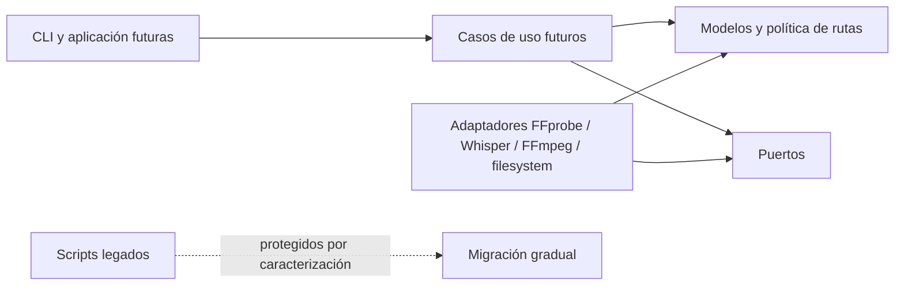

# Arquitectura del núcleo Python

Este documento fija los límites técnicos introducidos en P0.2. Complementa el
contrato funcional de [`PROJECT.md`](PROJECT.md) y [`WORKFLOW.md`](WORKFLOW.md),
pero no adelanta el comportamiento de las fases posteriores.

## Objetivo de P0.2

Crear un núcleo importable, portable y comprobable que permita incorporar el
nuevo pipeline sin seguir ampliando los scripts monolíticos existentes.

P0.2 define:

- modelos inmutables para streams, subtítulos, inventarios, planes y resultados;
- la política pura de rutas `output/` y `trash/`;
- errores propios del proyecto;
- puertos tipados para aislar herramientas y efectos externos.

P0.2 no implementa todavía:

- descubrimiento o asociación de archivos;
- ejecución de FFprobe, Whisper o FFmpeg;
- planner funcional;
- validación SRT;
- verificación, publicación o movimientos reales;
- CLI nueva ni integración con `menu.sh`.

Esas responsabilidades se agregan en P0.3 y fases posteriores detrás de los
límites definidos aquí.

## Dirección de dependencias



- Los modelos no importan adaptadores ni scripts.
- Los puertos dependen de modelos, no de implementaciones concretas.
- Los futuros adaptadores dependen hacia adentro de modelos y puertos.
- La aplicación futura coordina puertos; no invoca `subprocess` directamente.
- `menu.sh` podrá llamar a la CLI, pero nunca contendrá la única lógica.

## Paquete `subtitles_bridge`

| Módulo | Responsabilidad |
| --- | --- |
| `errors.py` | Excepciones accionables del núcleo y de rutas de entrada. |
| `models.py` | Tipos de dominio inmutables y sus invariantes locales. |
| `paths.py` | Resolver el workspace y derivar salidas sin crear ni mover archivos. |
| `ports.py` | Protocolos para inspección, transcripción, mux, verificación, publicación y archivado. |

No se crean módulos vacíos para las fases futuras. Cada adaptador o caso de uso
aparecerá cuando exista comportamiento y pruebas que lo justifiquen.

## Invariantes iniciales

- Los índices de stream son no negativos y únicos por inventario.
- Codec e idioma nunca se representan con cadenas vacías; un idioma desconocido
  usa `und`.
- Un subtítulo externo o generado referencia un archivo.
- Un subtítulo embebido referencia un índice de stream.
- Cada etapa aparece como máximo una vez en un plan.
- Una fuente administrada pertenece al nivel principal del workspace y es MP4
  o MKV.
- Derivar rutas no crea `output/`, `trash/` ni staging.

## Relación con el prototipo

`process_videos.py`, `local_translate_srt.py` y
`tools/normalize_video_mp4/normalize_video_mp4.py` permanecen sin cambios en
P0.2. El paquete nuevo no los importa. Sus pruebas de caracterización continúan
protegiendo el comportamiento conocido mientras las siguientes fases extraen o
reemplazan responsabilidades gradualmente.

## Extensión P0.3: inventario read-only

P0.3 agrega componentes concretos detrás de los límites del núcleo:

| Módulo | Responsabilidad |
| --- | --- |
| `languages.py` | Normalización conservadora de metadata conocida. |
| `srt.py` | Decodificación y validación estructural de SRT sin reescribirlos. |
| `adapters/ffprobe.py` | Ejecución inyectable de FFprobe y mapeo JSON a modelos. |
| `discovery.py` | Videos, sidecars, asociación exacta e inventario por workspace. |

El servicio de discovery recibe los puertos de inspección y validación. Devuelve
inventarios e incidencias; no decide qué etapas ejecutar. Los SRT ambiguos o no
asociados quedan fuera de todos los inventarios, mientras que un SRT inválido
con asociación inequívoca permanece registrado como `invalid` para explicar el
estado observado.

La implementación no crea directorios ni modifica insumos. Planner, generación,
mux, verificación y archivado continúan fuera de P0.3.

## Extensión P0.4: planificación y resumen

P0.4 agrega tres componentes puros sobre los inventarios existentes:

| Módulo | Responsabilidad |
| --- | --- |
| `planner.py` | Aplicar la matriz por video y resolver el audio inequívoco. |
| `batch_planner.py` | Propagar incidencias y detectar colisiones entre destinos del lote. |
| `summary.py` | Convertir planes e incidencias en un resumen previo determinista. |

El planner recibe `DiscoveryResult`, política de rutas y elecciones explícitas.
No consulta Whisper, FFmpeg ni backends de traducción, y no crea, renombra o
mueve archivos. Discovery aporta la existencia de destinos administrados; una
salida solo se considera válida cuando el llamador la marca como verificada.
Así se mantiene separado el razonamiento read-only de la verificación real que
se implementará en P0.7.

`BatchPlan` conserva todos los planes por video y las incidencias globales. Un
plan con cualquier decisión `needs-input`, o un lote con incidencias de
discovery sin resolver, no es ejecutable. Esta propiedad será la barrera que
las futuras capas de aplicación deberán comprobar antes de iniciar etapas con
efectos.

## Extensión P0.5: transcripción local en staging

P0.5 agrega tres responsabilidades detrás de puertos inyectables:

| Módulo | Responsabilidad |
| --- | --- |
| `adapters/ffmpeg_audio.py` | Extraer únicamente el stream elegido a PCM temporal sin tocar la fuente. |
| `adapters/whisper.py` | Resolver un modelo local e invocar la API Python de Whisper con `task=transcribe`. |
| `transcription.py` | Respetar el plan, coordinar staging, renderizar/validar SRT y limpiar temporales. |

`AudioExtractor` y `SpeechRecognizer` permiten sustituir FFmpeg y Whisper en
pruebas. El adaptador Whisper se importa de forma diferida: el resto del núcleo
continúa siendo importable aunque la dependencia opcional no esté instalada.
Las fallas esperadas se convierten en excepciones de proyecto; ninguna se
reduce a un valor nulo que una futura CLI pueda confundir con éxito.

El único archivo persistente de esta etapa es el SRT válido dentro de
`staging/`. El audio PCM y cualquier SRT nuevo que no supere validación se
eliminan. Publicación, remux y archivado siguen fuera de P0.5.

## Extensión P0.6: remux MKV en staging

P0.6 conserva el puerto `MediaMuxer` y agrega dos componentes:

| Módulo | Responsabilidad |
| --- | --- |
| `adapters/ffmpeg_mux.py` | Construir y ejecutar un comando FFmpeg de copia total, sin sobrescritura ni recodificación. |
| `muxing.py` | Respetar el plan, reunir exactamente los subtítulos previstos y controlar la salida de staging. |

El constructor del comando es puro y se prueba sin FFmpeg. El adaptador recibe
un runner inyectable, agrega solamente sidecars validados y deja que FFmpeg lea
los archivos por streaming. La etapa de aplicación distingue un sidecar
generado por P0.5 de los artefactos ya seleccionados por el planner y nunca
adivina entradas adicionales.

P0.6 termina con un MKV temporal no verificado. `OutputVerifier` y
`OutputPublisher` permanecen sin implementación hasta P0.7, por lo que ninguna
salida de esta fase llega a `output/` ni habilita movimientos a `trash/`.

## Extensión P0.7: verificación y publicación

P0.7 incorpora tres componentes y una prueba de dominio inmutable:

| Módulo | Responsabilidad |
| --- | --- |
| `verification.py` | Comparar el MKV de staging con el inventario y producir `VerifiedOutput`. |
| `publishing.py` | Respetar el plan, revalidar la identidad del archivo y autorizar la publicación. |
| `adapters/filesystem_publish.py` | Reservar sin sobrescritura y mover atómicamente de staging a `output/`. |
| `VerifiedOutput` | Vincular fuente, ruta, inspección, subtítulos esperados, tamaño y `mtime`. |

`OutputVerifier` devuelve `VerifiedOutput` en lugar de un éxito nulo. De este
modo `PublishingStage` no acepta una ruta arbitraria: requiere la prueba creada
por la verificación y vuelve a comparar su snapshot antes de delegar en
`OutputPublisher`. El verificador recibe `MediaProbe`, por lo que FFprobe sigue
inyectable y las pruebas permanecen offline.

La verificación no modifica archivos. El publicador mueve únicamente el MKV
verificado y jamás toca la fuente o los sidecars; esos movimientos pertenecen
a P0.8. Una salida rechazada permanece en staging para diagnóstico y nunca se
trata como válida por mera existencia.

## Extensión P0.8: cuarentena transaccional

P0.8 agrega una prueba de publicación y separa la política de aplicación de los
movimientos concretos:

| Módulo | Responsabilidad |
| --- | --- |
| `PublishedOutput` | Vincular la salida final con su fuente, subtítulos exactos y snapshot verificado. |
| `archiving.py` | Respetar el plan, comprobar la prueba publicada y seleccionar únicamente los insumos consumidos. |
| `adapters/filesystem_archive.py` | Reservar `trash/<base>/`, mover sin sobrescritura y revertir movimientos parciales. |
| `ArchivedInputs` | Registrar de forma inmutable las rutas originales y sus destinos de cuarentena. |

`PublishingStage` deja de devolver una ruta sin contexto y produce
`PublishedOutput`. `ArchivingStage` valida de nuevo el MKV final, deriva los
sidecars desde los mismos artefactos aprobados por verificación y delega en
`InputArchiver`. El adaptador recibe un movimiento inyectable para simular
éxitos, fallos y rollback sin depender del filesystem productivo.

La cuarentena no intenta convertir varios movimientos en una falsa operación
atómica. Reserva todos los destinos, mueve el video al final y, ante un fallo,
restaura en orden inverso los archivos ya movidos. Solo elimina reservas y un
directorio vacío creados por la propia ejecución; nunca borra contenido útil,
la salida publicada ni un destino preexistente.

## Extensión P0.9: orquestación y resultados

P0.9 agrega la capa de aplicación que conecta las etapas sin acoplar el dominio
a argparse, shell o adaptadores concretos:

| Módulo | Responsabilidad |
| --- | --- |
| `execution.py` | Ejecutar por video las cinco etapas inyectadas, aislar fallos y construir resultados. |
| `application.py` | Imprimir el resumen final y devolver el código de salida sin terminar el intérprete. |
| `StageResult` | Registrar estado y mensaje de una etapa planificada. |
| `VideoResult` | Conservar estado final, salida, cuarentena y resultados de etapas. |
| `BatchResult` | Agregar videos e incidencias, calcular conteos, estado global y exit code. |
| `summary.py` | Renderizar planes read-only y resultados finales deterministas. |

`BatchExecutor` depende de protocolos estructurales para las etapas, no de
FFmpeg, Whisper o filesystem. Los artefactos `SubtitleArtifact`,
`VerifiedOutput`, `PublishedOutput` y `ArchivedInputs` avanzan únicamente hacia
la etapa siguiente. Una excepción queda contenida en el resultado del video;
el ejecutor sigue con otros videos cuando el lote completo era ejecutable.

El paquete no llama a `sys.exit`: esa decisión pertenece al entry point. La
frontera de aplicación devuelve `BatchResult.exit_code`, lo que permite probar
la salida textual y los estados sin procesos reales. P1.1-P1.2 aportarán la CLI
de argumentos y configuración; P0.9 solo establece la ejecución y propagación
correctas que esa CLI consumirá.

## Pruebas

Los modelos, rutas, puertos, discovery y planner se prueban con `unittest`,
directorios temporales y adaptadores falsos. La suite completa continúa
ejecutándose con:

```bash
python3 -m unittest discover -s tests -v
```
