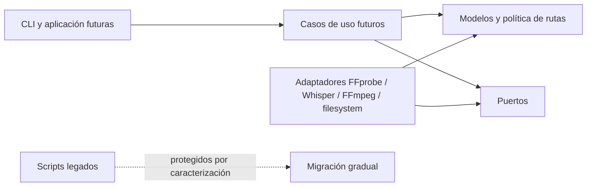

# Arquitectura del núcleo Python

Este documento fija los límites técnicos introducidos en P0.2. Complementa el
contrato funcional de [`PROJECT.md`](PROJECT.md) y [`WORKFLOW.md`](WORKFLOW.md),
pero no adelanta el comportamiento de las fases posteriores.

## Objetivo de P0.2

Crear un núcleo importable, portable y comprobable que permita incorporar el
nuevo pipeline sin seguir ampliando los scripts monolíticos existentes.

P0.2 define:

- modelos inmutables para streams, subtítulos, inventarios, planes y resultados;
- la política pura de rutas `output/` y `trash/`;
- errores propios del proyecto;
- puertos tipados para aislar herramientas y efectos externos.

P0.2 no implementa todavía:

- descubrimiento o asociación de archivos;
- ejecución de FFprobe, Whisper o FFmpeg;
- planner funcional;
- validación SRT;
- verificación, publicación o movimientos reales;
- CLI nueva ni integración con `menu.sh`.

Esas responsabilidades se agregan en P0.3 y fases posteriores detrás de los
límites definidos aquí.

## Dirección de dependencias



- Los modelos no importan adaptadores ni scripts.
- Los puertos dependen de modelos, no de implementaciones concretas.
- Los futuros adaptadores dependen hacia adentro de modelos y puertos.
- La aplicación futura coordina puertos; no invoca `subprocess` directamente.
- `menu.sh` podrá llamar a la CLI, pero nunca contendrá la única lógica.

## Paquete `subtitles_bridge`

| Módulo | Responsabilidad |
| --- | --- |
| `errors.py` | Excepciones accionables del núcleo y de rutas de entrada. |
| `models.py` | Tipos de dominio inmutables y sus invariantes locales. |
| `paths.py` | Resolver el workspace y derivar salidas sin crear ni mover archivos. |
| `ports.py` | Protocolos para inspección, transcripción, mux, verificación, publicación y archivado. |

No se crean módulos vacíos para las fases futuras. Cada adaptador o caso de uso
aparecerá cuando exista comportamiento y pruebas que lo justifiquen.

## Invariantes iniciales

- Los índices de stream son no negativos y únicos por inventario.
- Codec e idioma nunca se representan con cadenas vacías; un idioma desconocido
  usa `und`.
- Un subtítulo externo o generado referencia un archivo.
- Un subtítulo embebido referencia un índice de stream.
- Cada etapa aparece como máximo una vez en un plan.
- Una fuente administrada pertenece al nivel principal del workspace y es MP4
  o MKV.
- Derivar rutas no crea `output/`, `trash/` ni staging.

## Relación con el prototipo

`process_videos.py`, `local_translate_srt.py` y
`tools/normalize_video_mp4/normalize_video_mp4.py` permanecen sin cambios en
P0.2. El paquete nuevo no los importa. Sus pruebas de caracterización continúan
protegiendo el comportamiento conocido mientras las siguientes fases extraen o
reemplazan responsabilidades gradualmente.

## Pruebas

Los modelos, rutas y puertos se prueban con `unittest`, directorios temporales y
adaptadores falsos. La suite completa continúa ejecutándose con:

```bash
python3 -m unittest discover -s tests -v
```
