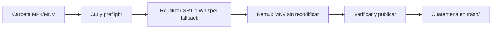
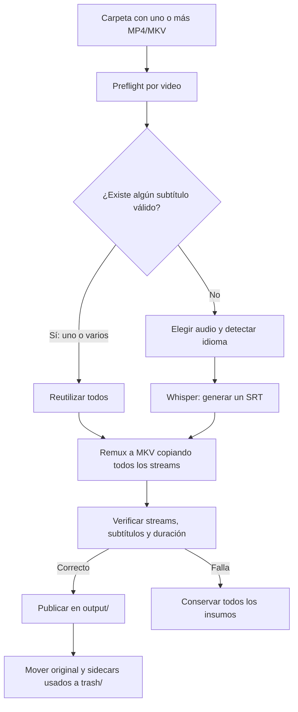

# Objetivo y alcance del proyecto

## Resumen

Subtitles Bridge es una CLI para procesar una carpeta con uno o más videos,
reutilizar todos los subtítulos válidos que ya estén asociados a cada video y
generar un subtítulo únicamente cuando no exista ninguno. El resultado es un
MKV nuevo con las pistas de subtítulos seleccionables, sin quemarlas sobre la
imagen ni modificar la calidad del contenido original.

La prioridad no es convertir formatos, traducir siempre ni normalizar video.
La prioridad es resolver de forma segura y reanudable el ciclo de vida de los
subtítulos. El núcleo debe ser portable a macOS, Linux y Windows, aunque el
desarrollo y la validación comienzan en macOS.

## Objetivo acordado

> Procesar de forma confiable una carpeta de videos, incorporar como pistas
> seleccionables todos los subtítulos válidos asociados a cada uno y generar
> un único subtítulo en el idioma hablado solamente cuando no exista ninguno;
> crear un MKV nuevo sin recodificar ni descartar streams, verificarlo y, solo
> entonces, mover automáticamente los insumos ya integrados a `trash/` para
> que el usuario decida cuándo eliminarlos definitivamente.

## Prioridades del producto

1. Reutilizar antes de generar.
2. Incorporar todos los subtítulos asociados, no solo inglés y español.
3. Generar un subtítulo únicamente si no existe ninguno válido.
4. Conservar sin recodificación todos los streams del video original.
5. Publicar y archivar insumos solo después de verificar el resultado.
6. Mantener cada etapa modular, comprobable y reanudable.
7. Evaluar MP4 u otras conversiones únicamente como opciones posteriores.

## Conceptos separados

- **Idioma del audio:** solo determina qué audio transcribir y en qué idioma
  generar un subtítulo cuando no existe ninguno.
- **Subtítulos disponibles:** determinan qué pistas se incorporan. Si hay uno
  o varios, se incorporan todos y no se ejecuta Whisper.
- **Contenedor:** MP4 y MKV no determinan por sí mismos la calidad. MKV se elige
  como salida porque es flexible para múltiples streams y subtítulos.
- **Remultiplexado:** cambiar o reconstruir el contenedor copiando streams no
  es comprimir. El flujo objetivo no recodifica audio ni video.

## Flujo implementado actualmente

La CLI P1.3 conecta el contrato confirmado de extremo a extremo y permite
inspeccionarlo o reanudarlo de forma explícita:



1. `subtitles_bridge_cli.py` acepta una carpeta desde cualquier `cwd`.
2. Discovery inspecciona MP4/MKV y todos los subtítulos asociados.
3. El planner muestra el preflight y bloquea ambigüedades antes de modificar.
4. La aplicación ejecuta las etapas necesarias y omite Whisper cuando ya hay
   cualquier subtítulo válido.
5. El MKV se verifica antes de publicar y mover insumos a `trash/`.
6. `--preflight` permite terminar después del plan, `--audio` resuelve una
   selección por video y `--resume` vuelve a verificar una salida publicada
   antes de autorizar únicamente el archivado pendiente.
7. El modelo y dispositivo de Whisper son configurables, pero continúan
   cargándose solamente cuando realmente falta todo subtítulo válido.
8. `menu.sh` es un wrapper de esa CLI; `setup.sh` localiza `.venv` y
   `requirements.txt` desde su propia ubicación.
9. `--doctor` comprueba el runtime sin procesar un workspace; `setup.sh` valida
   requisitos sin instalar herramientas del sistema ni descargar modelos.

`process_videos.py` y `local_translate_srt.py` conservan el prototipo legado
solo para caracterización; el menú ya no los utiliza.

La utilidad de `tools/normalize_video_mp4/` es independiente y sirve como
referencia para FFprobe, FFmpeg y metadatos, pero su objetivo de normalizar a
MP4 ya no define el pipeline principal.

## Flujo objetivo



La matriz completa y las reglas transaccionales están en
[`WORKFLOW.md`](WORKFLOW.md).

## Entradas iniciales

- Una carpeta seleccionada por el usuario.
- Procesamiento no recursivo.
- Videos `.mp4` y `.mkv`.
- SRT externos asociados de cualquier idioma.
- Pistas de subtítulos embebidas de cualquier idioma.
- Uno o más streams de audio, que siempre se conservan.

El formato de entrada no cambia la prioridad funcional. MP4 y MKV se aceptan
porque son los contenedores habituales del usuario; otros formatos quedan para
una evaluación posterior.

## Contrato de salida

Antes de procesar:

```text
carpeta/
├── lesson-01.mp4
├── lesson-01.en.srt
└── lesson-01.es.srt
```

Después de crear y verificar el resultado:

```text
carpeta/
├── output/
│   └── lesson-01.subtitled.mkv
└── trash/
    └── lesson-01/
        ├── lesson-01.mp4
        ├── lesson-01.en.srt
        └── lesson-01.es.srt
```

- `output/lesson-01.subtitled.mkv` es el único resultado de consumo normal.
- Contiene todos los streams del original y todas las pistas de subtítulos
  válidas asociadas.
- Audio y video mantienen sus codecs: no se comprimen ni recodifican.
- Ninguna pista de subtítulos queda activa por defecto.
- El original y los SRT externos incorporados se mueven automáticamente a
  `trash/` solo después de una verificación exitosa.
- `trash/` es una cuarentena reversible, no una papelera del sistema. El
  programa nunca elimina definitivamente su contenido.
- Nada dentro de `trash/` se sobrescribe. Una colisión detiene el archivado y
  se informa de forma accionable.
- Los archivos inválidos, ambiguos o no incorporados no se mueven.

### Aislamiento de las rutas administradas

`output/`, `staging/` y `trash/` siempre se resuelven dentro de la carpeta de
videos elegida, no dentro del directorio desde el que se lanzó el comando. Dos
aplicaciones que usen esos mismos nombres en carpetas de trabajo diferentes no
comparten rutas y, por lo tanto, no colisionan.

Una colisión solo es posible si dos procesos o aplicaciones intentan ocupar la
misma ruta final dentro del mismo workspace. Esa posibilidad es baja para el
uso personal previsto y ya se protege con planificación previa y reservas
exclusivas: se informa el conflicto y nunca se sobrescribe. Por ahora no se
agrega una subcarpeta con el nombre de la aplicación, porque aumentaría la
complejidad de las rutas sin aportar aislamiento adicional al caso normal.

## Política de generación

- Con uno o más subtítulos válidos asociados: se omite Whisper y se incorporan
  todos.
- Sin subtítulos externos pero con pistas embebidas válidas: se omite Whisper
  y se conservan todas las pistas embebidas.
- Sin ningún subtítulo válido: se genera un solo SRT en el idioma hablado.
- Si existe un único audio o un único audio marcado como predeterminado, ese es
  el candidato para transcripción.
- Si hay varios audios y no puede elegirse uno con seguridad, el plan solicita
  una decisión antes de modificar archivos.
- No se genera una traducción adicional para completar un par de idiomas.

## Preservación de streams

El pipeline maneja subtítulos; no es un normalizador multimedia. Por defecto:

- copia todos los streams de video;
- copia todos los streams de audio;
- conserva los codecs, idiomas y disposiciones de las pistas de audio;
- conserva las pistas de subtítulos embebidas;
- conserva capítulos, metadatos y otros streams compatibles;
- agrega los SRT externos como nuevas pistas;
- falla de forma segura antes que recodificar o descartar silenciosamente un
  stream incompatible.

Un archivo de 2 GB seguirá conteniendo esencialmente los mismos datos de audio
y video. El tamaño puede variar levemente por el contenedor y los subtítulos,
pero no por una compresión deliberada.

## Evaluación P2.1: contenedor de salida seleccionable pendiente

La alternativa está documentada, pero no queda priorizada para implementación.
El comportamiento publicado continúa produciendo únicamente MKV y P2.1 solo se
retomará ante una incompatibilidad concreta de un cliente que MP4 resuelva sin
transcodificar audio o video.

### Evidencia de uso

El uso real es una biblioteca personal centralizada en un servidor Proxmox con
un Intel Core i5-4440, consumida desde una tablet sin copiar permanentemente
los archivos al dispositivo. Algunos videos 1080p se reproducen sin problemas
y otros presentan tirones desde el servidor, aunque esos mismos archivos
funcionan correctamente cuando se reproducen localmente en la tablet.

La extensión `.mkv` por sí sola no demuestra la causa. El resultado depende de
la combinación de contenedor, codecs, perfil, profundidad de bits, bitrate,
subtítulos elegidos, compatibilidad del cliente y de si el servidor entrega el
archivo directamente, lo remultiplexa o transcodifica. El caso problemático
inspeccionado resultó ser ya un MP4, por lo que P2.1 no se justifica como
solución de rendimiento.

### Condiciones si P2.1 se retoma

- MKV continúa siendo la salida predeterminada y de máxima flexibilidad.
- MP4 se ofrece como salida opcional de compatibilidad cuando el inventario
  completo puede representarse de forma segura.
- Elegir MP4 nunca autoriza a recodificar video o audio, reducir resolución,
  cambiar bitrate, eliminar pistas ni alterar disposiciones de audio.
- MP4 puede contener varias pistas de audio; P2.1 conserva todas las que ya
  existen, aunque agregar audios externos continúa fuera de alcance.
- Los subtítulos de texto que puedan verificarse se convierten a `mov_text`
  cuando MP4 lo requiere. Esta es una conversión deliberada y limitada al
  codec de subtítulos para conservarlos como pistas seleccionables; no quema
  texto sobre el video ni modifica audio o video.
- Un subtítulo gráfico, un subtítulo con estilo que no pueda representarse sin
  pérdida aceptable, un adjunto o cualquier otro stream incompatible bloquea
  MP4 antes del mux. Nunca se omite, quema, aplana ni reemplaza en silencio.
- Ante una incompatibilidad, el preflight identifica stream y codec y propone
  MKV. No cambia automáticamente el formato solicitado.
- La salida esperada será `output/<base>.subtitled.mkv` o
  `output/<base>.subtitled.mp4`; publicación, verificación, reanudación y
  cuarentena mantienen las mismas garantías transaccionales.

### Diagnóstico del caso real

El archivo
`Malcolm.in.the.Middle.Lifes.Still.Unfair.S01E04.english-default.with-subs.mp4`
contiene video H.264 High Level 4.0, `yuv420p`, 1920x1080 a 23.976 fps y unos
5.55 Mbps; un audio inglés E-AC-3 5.1 de 256 kbps; y 26 pistas `mov_text`. Una
pista inglesa está marcada como subtítulo predeterminado. El contenedor promedia
5.82 Mbps, su pico de video medido por segundo ronda 20.13 Mbps y el átomo
`moov` ya está al comienzo para acceso progresivo.

Sus 1.50 GB para 34 minutos no son anómalos para 1080p con ese bitrate y no
demuestran necesidad de compresión. El codec H.264 del caso también descarta la
hipótesis HEVC para este archivo concreto. El candidato principal es que el
cliente o servidor no pueda entregar el subtítulo predeterminado o el audio
E-AC-3 directamente y active transcodificación; si el servidor informa
`Direct Play`, deben investigarse red, almacenamiento y buffering en lugar de
recodificar preventivamente.

La ficha oficial del
[i5-4440](https://www.intel.com/content/www/us/en/products/sku/75038/intel-core-i54440-processor-6m-cache-up-to-3-30-ghz/specifications.html)
confirma Intel HD Graphics 4600 y Quick Sync, pero todavía debe verificarse que
la iGPU esté expuesta y utilizada por el servicio alojado en Proxmox. Esa
configuración pertenece al servidor, no a Subtitles Bridge.

El siguiente diagnóstico requiere conocer el software servidor y observar su
modo de reproducción y motivo de transcodificación. Una prueba inmediata es
reproducir el mismo archivo desde el servidor con los subtítulos desactivados:
si desaparecen los tirones, la pista predeterminada y su tratamiento quedan
confirmados como disparador.

## Etapas y responsabilidades previstas

El núcleo se implementará en Python mediante módulos pequeños:

1. descubrimiento y asociación de archivos;
2. inspección de streams con FFprobe;
3. modelos de inventario y planificación;
4. adaptador de Whisper;
5. construcción y ejecución de FFmpeg;
6. verificación del resultado;
7. publicación atómica y archivado en `trash/`;
8. CLI y resumen del lote.

Los scripts `.sh` pueden ofrecer instalación o una interfaz interactiva, pero
no contendrán la lógica principal ni serán la única forma de ejecutar el
programa.

Los límites técnicos y la dirección de dependencias del paquete se describen
en [`ARCHITECTURE.md`](ARCHITECTURE.md).

## Alcance mínimo de la primera versión confiable

- macOS validado primero, con núcleo portable.
- MP4 y MKV no recursivos.
- Asociación conservadora de subtítulos por video.
- Reutilización de todos los subtítulos válidos, externos o embebidos.
- Whisper local únicamente como fallback.
- MKV final con streams copiados y subtítulos seleccionables.
- Staging, verificación y publicación segura.
- Archivado automático y sin sobrescritura en `trash/`.
- Reanudación segura y códigos de salida distintos de cero ante fallos.
- Pruebas offline para el planner, FFmpeg, verificación y movimientos.

## Fuera de alcance por ahora

- traducción automática obligatoria;
- completar siempre un conjunto fijo de idiomas;
- compresión, normalización o mejora de calidad;
- recodificación automática por compatibilidad;
- eliminación definitiva de originales o subtítulos;
- salida MP4 obligatoria;
- interfaz gráfica, servicio web o base de datos;
- procesamiento recursivo o formatos adicionales;
- edición manual, OCR de subtítulos gráficos o procesamiento distribuido.

## Política de runtime y dependencias P1.4

El flujo principal soporta CPython 3.10, 3.11, 3.12 y 3.13. Una versión menor
anterior o posterior queda fuera de la matriz soportada hasta que se valide de
forma explícita; `setup.sh` y `--doctor` deben rechazarla con un mensaje
accionable en lugar de intentar una instalación incierta.

`requirements.txt` representa únicamente el flujo principal. Fija la versión
directa de OpenAI Whisper que utiliza el adaptador local y deja que esa
distribución declare sus dependencias transitivas multiplataforma. No fija
NumPy, Numba, llvmlite, PyTorch u otras transitivas por una instalación
específica: una congelación completa requeriría artefactos separados y
validados por plataforma, versión de Python y acelerador.

La traducción remota continúa fuera del flujo confirmado. El prototipo
`local_translate_srt.py` permanece protegido por pruebas de caracterización,
pero su backend histórico se declara en `requirements-legacy.txt`, no se
instala mediante `setup.sh` y nunca se carga desde la CLI principal. Instalar
ese archivo es una acción manual y consciente de que el texto puede enviarse a
un tercero. P2.2 deberá reemplazar esta separación temporal por un contrato de
traducción opcional antes de conectarla al producto.

## Política de checks automáticos P1.5

El repositorio tendrá una única puerta de calidad local, ejecutada por
`tools/check.py`, que comprueba formato y lint de Python, formato y lint de los
wrappers Bash, la suite offline completa y smokes reales de la CLI. Las
herramientas de desarrollo se mantienen separadas de `requirements.txt` y
nunca se instalan mediante `setup.sh`.

Ruff controla el paquete objetivo, sus entry points, las pruebas y las
herramientas mantenidas. Los prototipos `process_videos.py`,
`local_translate_srt.py` y `tools/normalize_video_mp4/` quedan fuera del
reformateo automático para evitar una reescritura masiva sin valor funcional;
sus pruebas de caracterización siguen ejecutándose en cada cambio.

ShellCheck y shfmt comprueban `menu.sh` y `setup.sh`. El check solo inspecciona
el formato: nunca reescribe archivos automáticamente. Si falta una herramienta
local, falla con el comando de instalación documentado en vez de omitirla.

La CI ejecuta la puerta de calidad y una matriz nativa sobre macOS, Linux y
Windows. Cubre todas las versiones CPython soportadas sin instalar Whisper ni
FFmpeg: las pruebas sustituyen dependencias externas y los smokes se limitan a
`--help` y al límite read-only de inspección expuesto como `--preflight`.

## Política de observabilidad P1.6

El texto legible continúa siendo la salida predeterminada. Para automatización,
`--output-format jsonl` emite exclusivamente objetos JSON independientes, uno
por línea, sin mezclar encabezados ni mensajes libres. Cada registro incluye
`schema_version`, un `sequence` creciente y un nombre de `event`; la primera
versión del esquema es `1`.

La secuencia estructurada distingue preflight, inicio y final de etapas, y
resultado final o error fatal. Los fallos de etapa registran como campos la
fuente, etapa, tipo de excepción, mensaje, ruta objetivo y, cuando corresponde,
el índice del stream de audio. Un resultado `partial` conserva además la salida
publicada, el destino de cuarentena, la etapa pendiente y la acción explícita
de reanudación.

La ETA nunca se basa en etapas omitidas ni en constantes de rendimiento
inventadas. Solo `transcribe`, `mux` y `verify` se consideran costosas. Durante
una ejecución, el estimador aprende la relación entre tiempo monotónico real y
duración multimedia de cada tipo de etapa completada; informa `null` mientras
falte una muestra aplicable o una duración válida. `publish` y `archive` quedan
fuera de la ETA, aunque sus resultados y fallos sí se registran.

## Política de experiencia interactiva P1.7

La herramienta puede operarse desde `menu.sh` sin conocer de memoria las
opciones avanzadas de la CLI. El menú expone preparación, preflight
read-only, procesamiento, reanudación, doctor y ayuda como acciones distintas.
Restablecer el entorno seguirá siendo una acción avanzada con confirmación y
nunca tocará videos, `output/` o `trash/`.

Cada resultado se explicará según sus códigos públicos: `0` completado u
omitido, `1` fallo, `2` decisión pendiente y `3` salida publicada con archivado
incompleto. El menú no reinterpretará un código no cero como éxito y recomendará
preflight, `--audio` o reanudación solo cuando corresponda.

La ayuda humana y `--help` describen primero el camino normal: elegir una
carpeta con MP4/MKV y sus SRT, inspeccionarla sin cambios, procesarla y revisar
`output/` y `trash/`. Configurar un servidor multimedia, solucionar una red o
agregar pistas externas de audio permanecen fuera del producto.

## Estado técnico observado (2026-08-09)

El flujo objetivo publicado implementa P0.1-P0.9 y P1.1-P1.7. La ejecución
hospedada `31325938882` validó la puerta completa y el núcleo en CPython
3.10-3.13 sobre Linux y en CPython 3.12 sobre macOS y Windows. Quedan límites
operativos explícitos para las siguientes fases:

- el parser SRT de traducción omite o altera bloques comunes;
- el parser de traducción todavía contiene mensajes con variables no
  interpoladas;
- existe una red de seguridad offline y un núcleo modular inicial; la CI
  confirma formato, lint, smokes y compatibilidad nativa en cada cambio;
- el prototipo de traducción legado usa Google y requiere Internet, pero no
  forma parte de la CLI principal;
- el normalizador MP4 importado es una CLI monolítica independiente y no debe
  conectarse sin pruebas de caracterización;
- P2.1 conserva un contrato candidato documentado, pero permanece pendiente y
  no priorizado porque el caso real problemático ya utiliza MP4.
- P1.7 cerró menú y ayuda antes de evaluar extensiones opcionales.

El orden de implementación actualizado está en [`../BACKLOG.md`](../BACKLOG.md).

## Decisiones confirmadas

- El problema principal son las pistas de subtítulos seleccionables.
- Se aceptan MP4 y MKV; MKV seguirá predeterminado y P2.1 agregará MP4 opcional
  solo si aparece una necesidad de compatibilidad que lo justifique.
- No se recodifica ni elimina audio o video para producir el resultado.
- Si P2.1 se retoma, MP4 aceptará solamente convertir subtítulos de texto a
  `mov_text`; una incompatibilidad bloqueará antes que omitir contenido.
- Se conservan todas las pistas de audio.
- El audio no dirige el alcance del producto: se preserva, pero no se agregan,
  buscan ni administran nuevas pistas de audio.
- Se incorporan todos los subtítulos válidos asociados, cualquiera sea su
  idioma.
- La existencia de cualquier subtítulo válido evita Whisper.
- Whisper genera un solo subtítulo cuando no existe ninguno.
- Ningún subtítulo queda activo por defecto.
- La salida se verifica antes de publicar o mover insumos.
- El original y los sidecars incorporados se mueven automáticamente a
  `trash/`, sin sobrescribir y sin borrado definitivo.
- La implementación será modular; shell queda limitado a wrappers útiles.
- El comportamiento se documenta antes de implementarse y se avanza por fases
  pequeñas.

## Decisiones que se resuelven durante el preflight

No bloquean el diseño general, pero requieren una elección por video cuando la
inspección no pueda decidir de forma segura:

- qué audio transcribir si existen varios sin un predeterminado inequívoco;
- qué idioma o asociación asignar a un SRT sin metadata o nombre suficiente;
- cómo proceder si dos archivos de entrada competirían por la misma ruta en
  `trash/`.

La CLI debe mostrar estas ambigüedades antes de modificar archivos; nunca debe
resolverlas por aproximación silenciosa.
