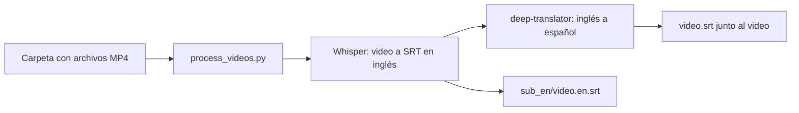

# Objetivo y alcance del proyecto

## Resumen

Subtitles Bridge es una CLI orientada a un flujo concreto: tomar un lote de
videos, generar subtítulos en inglés con Whisper, traducirlos al español y
ordenar ambos archivos de forma predecible.

El objetivo no es construir un editor de subtítulos ni una plataforma de
video. La prioridad es que este flujo sea confiable, reanudable y sencillo de
instalar en una computadora personal.

## Objetivo propuesto

> Procesar de forma confiable una carpeta de videos desde la terminal,
> conservando un SRT en español junto a cada video y el SRT original en inglés
> dentro de `sub_en/`, sin repetir trabajo válido ni sobrescribir archivos del
> usuario de manera inesperada.

Esta formulación es provisional hasta resolver las decisiones de alcance que
figuran al final del documento.

## Flujo actual



1. `menú.sh` ofrece instalación, procesamiento, limpieza y ayuda.
2. `setup.sh` crea `.venv` e instala las dependencias.
3. `process_videos.py` busca archivos `.mp4` en el directorio indicado.
4. Whisper genera un SRT en inglés con el modelo `small`.
5. `local_translate_srt.py` traduce el texto al español con Google mediante
   `deep-translator`.
6. El SRT en español queda junto al video y el inglés se mueve a `sub_en/`.
7. En ejecuciones posteriores se omiten etapas según los archivos existentes.

## Componentes

| Archivo | Responsabilidad actual |
| --- | --- |
| `menú.sh` | Interfaz interactiva y acceso al setup, proceso y limpieza. |
| `setup.sh` | Creacion del entorno virtual e instalación de dependencias. |
| `process_videos.py` | Orquestacion de Whisper, traducción, reanudación y archivos. |
| `local_translate_srt.py` | Parseo/traducción de SRT y selección del backend. |
| `requirements.txt` | Dependencias Python; solo algunas versiones estan fijadas. |

## Contrato de archivos propuesto

Para un video `clase-01.mp4`:

```text
carpeta/
├── clase-01.mp4
├── clase-01.srt
└── sub_en/
    └── clase-01.en.srt
```

- `clase-01.srt`: traducción al español para reproduccion directa.
- `sub_en/clase-01.en.srt`: transcripción original en inglés.
- Los archivos existentes no deberían sobrescribirse por defecto.
- `--force` deberia tener una semántica explícita: regenerar todo o solo una
  etapa. Hoy no regenera de forma consistente todos los artefactos.
- Una etapa solo deberia considerarse completa si su salida es valida, no solo
  porque exista un archivo con el nombre esperado.

## Alcance mínimo recomendado para una versión confiable

- macOS como plataforma soportada y comprobada.
- Procesamiento no recursivo de una carpeta.
- Entrada `.mp4` y flujo inglés a español.
- Whisper ejecutado localmente.
- Traduccion mediante un servicio configurable, documentando que el backend
  Google actual necesita Internet y envía el texto a un tercero.
- Reanudacion segura por video.
- Errores visibles mediante mensajes y codigos de salida distintos de cero.
- Pruebas automatizadas para el parseo SRT y las decisiones de reanudación.

## Fuera de alcance por ahora

Hasta que exista una necesidad concreta, no parece necesario agregar:

- interfaz gráfica o servicio web;
- base de datos, cuentas de usuario o servidor central;
- procesamiento distribuido;
- edición manual de subtítulos;
- soporte recursivo o para todos los formatos de video;
- empaquetado complejo o publicación en una tienda.

## Estado técnico observado (2026-08-05)

El repositorio se entiende y la separación general de responsabilidades es
razonable para su tamaño. Sin embargo, todavía debe considerarse un prototipo:

- el flujo instalado por `setup.sh` no encuentra el ejecutable Whisper de la
  propia `.venv` cuando se inicia desde el menú;
- el parser SRT basado en expresiones regulares no traduce el último bloque de
  un archivo común que termina con un solo salto de línea y agrega separadores
  extra;
- algunos errores no se reflejan en el código de salida y hay mensajes que
  imprimen `{e}` o `{out_dir}` literalmente;
- el menú y el setup dependen del directorio de trabajo actual;
- no hay pruebas automatizadas ni CI;
- la traducción predeterminada no es offline: usa el servicio de Google a
  través de `deep-translator`;
- el modelo, idiomas, backend y formatos estan fijados en partes del código.

El orden sugerido para resolver estos puntos está en [`../BACKLOG.md`](../BACKLOG.md).

## Decisiones de alcance pendientes

1. **Privacidad:** ¿"local" significa solo que la CLI se ejecuta localmente o
   que ningun texto puede salir del equipo?
2. **Matriz soportada:** ¿la versión objetivo puede limitarse formalmente a
   macOS + MP4 + inglés a español?
3. **Archivos existentes:** ¿un `video.srt` previo debe tratarse siempre como
   contenido del usuario y no sobrescribirse sin confirmacion?
4. **Interfaz principal:** ¿el menú interactivo es el producto principal o la
   CLI no interactiva también debe ser una interfaz estable para automatizar?
5. **Escala esperada:** ¿se procesan unos pocos videos cortos o lotes de muchas
   horas? Esto define si conviene priorizar batching, GPU y checkpoints.

