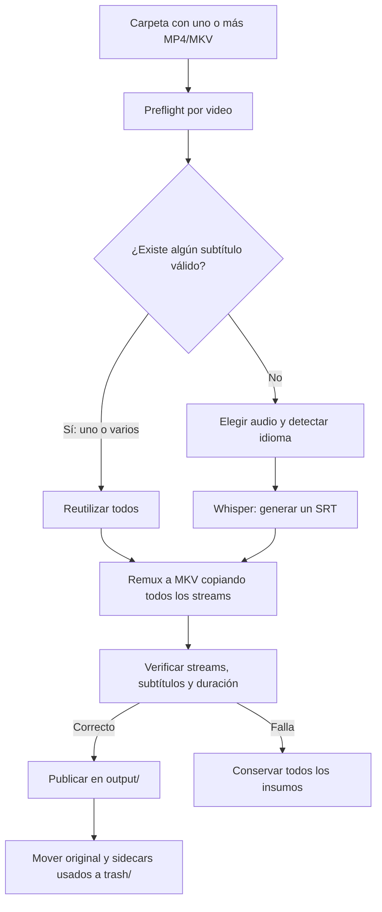

# Objetivo y alcance del proyecto

## Resumen

Subtitles Bridge es una CLI para procesar una carpeta con uno o más videos,
reutilizar todos los subtítulos válidos que ya estén asociados a cada video y
generar un subtítulo únicamente cuando no exista ninguno. El resultado es un
MKV nuevo con las pistas de subtítulos seleccionables, sin quemarlas sobre la
imagen ni modificar la calidad del contenido original.

La prioridad no es convertir formatos, traducir siempre ni normalizar video.
La prioridad es resolver de forma segura y reanudable el ciclo de vida de los
subtítulos. El núcleo debe ser portable a macOS, Linux y Windows, aunque el
desarrollo y la validación comienzan en macOS.

## Objetivo acordado

> Procesar de forma confiable una carpeta de videos, incorporar como pistas
> seleccionables todos los subtítulos válidos asociados a cada uno y generar
> un único subtítulo en el idioma hablado solamente cuando no exista ninguno;
> crear un MKV nuevo sin recodificar ni descartar streams, verificarlo y, solo
> entonces, mover automáticamente los insumos ya integrados a `trash/` para
> que el usuario decida cuándo eliminarlos definitivamente.

## Prioridades del producto

1. Reutilizar antes de generar.
2. Incorporar todos los subtítulos asociados, no solo inglés y español.
3. Generar un subtítulo únicamente si no existe ninguno válido.
4. Conservar sin recodificación todos los streams del video original.
5. Publicar y archivar insumos solo después de verificar el resultado.
6. Mantener cada etapa modular, comprobable y reanudable.
7. Evaluar MP4 u otras conversiones únicamente como opciones posteriores.

## Conceptos separados

- **Idioma del audio:** solo determina qué audio transcribir y en qué idioma
  generar un subtítulo cuando no existe ninguno.
- **Subtítulos disponibles:** determinan qué pistas se incorporan. Si hay uno
  o varios, se incorporan todos y no se ejecuta Whisper.
- **Contenedor:** MP4 y MKV no determinan por sí mismos la calidad. MKV se elige
  como salida porque es flexible para múltiples streams y subtítulos.
- **Remultiplexado:** cambiar o reconstruir el contenedor copiando streams no
  es comprimir. El flujo objetivo no recodifica audio ni video.

## Flujo implementado actualmente

El código existente todavía es un prototipo anterior al contrato confirmado:


1. `menu.sh` ofrece instalación, procesamiento, limpieza y ayuda.
2. `setup.sh` crea `.venv` e instala las dependencias.
3. `process_videos.py` busca únicamente archivos `.mp4`.
4. Whisper genera un SRT en inglés con el modelo `small`.
5. `local_translate_srt.py` lo traduce al español mediante Google.
6. El flujo no crea todavía el archivo final con pistas seleccionables.

La utilidad de `tools/normalize_video_mp4/` es independiente y sirve como
referencia para FFprobe, FFmpeg y metadatos, pero su objetivo de normalizar a
MP4 ya no define el pipeline principal.

## Flujo objetivo



La matriz completa y las reglas transaccionales están en
[`WORKFLOW.md`](WORKFLOW.md).

## Entradas iniciales

- Una carpeta seleccionada por el usuario.
- Procesamiento no recursivo.
- Videos `.mp4` y `.mkv`.
- SRT externos asociados de cualquier idioma.
- Pistas de subtítulos embebidas de cualquier idioma.
- Uno o más streams de audio, que siempre se conservan.

El formato de entrada no cambia la prioridad funcional. MP4 y MKV se aceptan
porque son los contenedores habituales del usuario; otros formatos quedan para
una evaluación posterior.

## Contrato de salida

Antes de procesar:

```text
carpeta/
├── lesson-01.mp4
├── lesson-01.en.srt
└── lesson-01.es.srt
```

Después de crear y verificar el resultado:

```text
carpeta/
├── output/
│   └── lesson-01.subtitled.mkv
└── trash/
    └── lesson-01/
        ├── lesson-01.mp4
        ├── lesson-01.en.srt
        └── lesson-01.es.srt
```

- `output/lesson-01.subtitled.mkv` es el único resultado de consumo normal.
- Contiene todos los streams del original y todas las pistas de subtítulos
  válidas asociadas.
- Audio y video mantienen sus codecs: no se comprimen ni recodifican.
- Ninguna pista de subtítulos queda activa por defecto.
- El original y los SRT externos incorporados se mueven automáticamente a
  `trash/` solo después de una verificación exitosa.
- `trash/` es una cuarentena reversible, no una papelera del sistema. El
  programa nunca elimina definitivamente su contenido.
- Nada dentro de `trash/` se sobrescribe. Una colisión detiene el archivado y
  se informa de forma accionable.
- Los archivos inválidos, ambiguos o no incorporados no se mueven.

## Política de generación

- Con uno o más subtítulos válidos asociados: se omite Whisper y se incorporan
  todos.
- Sin subtítulos externos pero con pistas embebidas válidas: se omite Whisper
  y se conservan todas las pistas embebidas.
- Sin ningún subtítulo válido: se genera un solo SRT en el idioma hablado.
- Si existe un único audio o un único audio marcado como predeterminado, ese es
  el candidato para transcripción.
- Si hay varios audios y no puede elegirse uno con seguridad, el plan solicita
  una decisión antes de modificar archivos.
- No se genera una traducción adicional para completar un par de idiomas.

## Preservación de streams

El pipeline maneja subtítulos; no es un normalizador multimedia. Por defecto:

- copia todos los streams de video;
- copia todos los streams de audio;
- conserva los codecs, idiomas y disposiciones de las pistas de audio;
- conserva las pistas de subtítulos embebidas;
- conserva capítulos, metadatos y otros streams compatibles;
- agrega los SRT externos como nuevas pistas;
- falla de forma segura antes que recodificar o descartar silenciosamente un
  stream incompatible.

Un archivo de 2 GB seguirá conteniendo esencialmente los mismos datos de audio
y video. El tamaño puede variar levemente por el contenedor y los subtítulos,
pero no por una compresión deliberada.

## Etapas y responsabilidades previstas

El núcleo se implementará en Python mediante módulos pequeños:

1. descubrimiento y asociación de archivos;
2. inspección de streams con FFprobe;
3. modelos de inventario y planificación;
4. adaptador de Whisper;
5. construcción y ejecución de FFmpeg;
6. verificación del resultado;
7. publicación atómica y archivado en `trash/`;
8. CLI y resumen del lote.

Los scripts `.sh` pueden ofrecer instalación o una interfaz interactiva, pero
no contendrán la lógica principal ni serán la única forma de ejecutar el
programa.

Los límites técnicos y la dirección de dependencias del paquete se describen
en [`ARCHITECTURE.md`](ARCHITECTURE.md).

## Alcance mínimo de la primera versión confiable

- macOS validado primero, con núcleo portable.
- MP4 y MKV no recursivos.
- Asociación conservadora de subtítulos por video.
- Reutilización de todos los subtítulos válidos, externos o embebidos.
- Whisper local únicamente como fallback.
- MKV final con streams copiados y subtítulos seleccionables.
- Staging, verificación y publicación segura.
- Archivado automático y sin sobrescritura en `trash/`.
- Reanudación segura y códigos de salida distintos de cero ante fallos.
- Pruebas offline para el planner, FFmpeg, verificación y movimientos.

## Fuera de alcance por ahora

- traducción automática obligatoria;
- completar siempre un conjunto fijo de idiomas;
- compresión, normalización o mejora de calidad;
- recodificación automática por compatibilidad;
- eliminación definitiva de originales o subtítulos;
- salida MP4 obligatoria;
- interfaz gráfica, servicio web o base de datos;
- procesamiento recursivo o formatos adicionales;
- edición manual, OCR de subtítulos gráficos o procesamiento distribuido.

## Estado técnico observado (2026-08-05)

El núcleo objetivo ya implementa las fases P0.1-P0.9, pero el comando y el menú
todavía ejecutan el flujo antiguo y deben considerarse un prototipo:

- Whisper instalado en `.venv` no se resuelve correctamente desde el menú;
- el parser SRT de traducción omite o altera bloques comunes;
- el parser de traducción todavía contiene mensajes con variables no
  interpoladas;
- los scripts dependen del directorio de trabajo;
- existe una red de seguridad offline y un núcleo modular inicial, pero todavía
  no hay CI;
- la traducción actual usa Google y requiere Internet;
- existen inventario, planner, transcripción local, remux MKV, verificación,
  publicación, archivado transaccional, orquestación, resumen de ejecución y
  códigos de salida en el núcleo, pero todavía no hay un entry point que
  componga todo el pipeline;
- el script legado y `menu.sh` ya propagan fallos con estado distinto de cero,
  aunque conservan su comportamiento funcional anterior;
- el normalizador MP4 importado es una CLI monolítica independiente y no debe
  conectarse sin pruebas de caracterización.

El orden de implementación actualizado está en [`../BACKLOG.md`](../BACKLOG.md).

## Decisiones confirmadas

- El problema principal son las pistas de subtítulos seleccionables.
- Se aceptan MP4 y MKV; el resultado principal será MKV.
- No se recodifica ni elimina ningún stream para producir el resultado.
- Se conservan todas las pistas de audio.
- Se incorporan todos los subtítulos válidos asociados, cualquiera sea su
  idioma.
- La existencia de cualquier subtítulo válido evita Whisper.
- Whisper genera un solo subtítulo cuando no existe ninguno.
- Ningún subtítulo queda activo por defecto.
- La salida se verifica antes de publicar o mover insumos.
- El original y los sidecars incorporados se mueven automáticamente a
  `trash/`, sin sobrescribir y sin borrado definitivo.
- La implementación será modular; shell queda limitado a wrappers útiles.
- El comportamiento se documenta antes de implementarse y se avanza por fases
  pequeñas.

## Decisiones que se resuelven durante el preflight

No bloquean el diseño general, pero requieren una elección por video cuando la
inspección no pueda decidir de forma segura:

- qué audio transcribir si existen varios sin un predeterminado inequívoco;
- qué idioma o asociación asignar a un SRT sin metadata o nombre suficiente;
- cómo proceder si dos archivos de entrada competirían por la misma ruta en
  `trash/`.

La CLI debe mostrar estas ambigüedades antes de modificar archivos; nunca debe
resolverlas por aproximación silenciosa.
