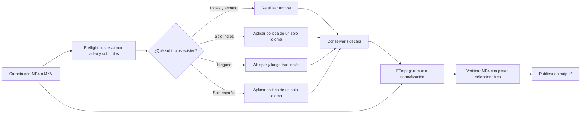

# Objetivo y alcance del proyecto

## Resumen

Subtitles Bridge es una CLI para un flujo concreto: tomar una carpeta con
videos, reutilizar o generar subtítulos en inglés y español, conservar ambos
archivos y crear un MP4 final donde VLC permita seleccionar cualquiera de los
dos idiomas.

El objetivo no es construir un editor de subtítulos ni una plataforma de
video. La prioridad es que este flujo sea confiable, reanudable y sencillo de
usar en una computadora personal. Debe poder ejecutarse en macOS, Linux y
Windows, pero el desarrollo y la validación comienzan en macOS.

## Objetivo acordado

> Procesar de forma confiable una carpeta de videos, reutilizar los subtítulos
> existentes o generar únicamente los faltantes, conservar sus SRT en inglés y
> español, y producir un MP4 nuevo con ambas pistas
> seleccionables en VLC, sin quemar texto sobre la imagen, repetir trabajo
> válido ni sobrescribir archivos del usuario de manera inesperada.

## Flujo implementado actualmente


1. `menu.sh` ofrece instalación, procesamiento, limpieza y ayuda.
2. `setup.sh` crea `.venv` e instala las dependencias.
3. `process_videos.py` busca archivos `.mp4` en el directorio indicado.
4. Whisper genera un SRT en inglés con el modelo `small`.
5. `local_translate_srt.py` traduce el texto al español con Google mediante
   `deep-translator`.
6. El SRT en español queda junto al video y el inglés se mueve a `sub_en/`.
7. En ejecuciones posteriores se omiten etapas según los archivos existentes.

La utilidad incorporada en `tools/normalize_video_mp4/` ya puede crear un MP4
con pistas seleccionables, pero todavía no está conectada al flujo por lotes.

## Flujo objetivo incremental



Whisper puede leer el archivo fuente directamente mediante FFmpeg. No es
necesario convertir primero un MKV completo: la normalización y el agregado de
pistas pueden realizarse una sola vez, al final.

La matriz completa de detección y decisiones está en
[`WORKFLOW.md`](WORKFLOW.md).

## Componentes

| Archivo | Responsabilidad actual |
| --- | --- |
| `menu.sh` | Interfaz interactiva y acceso al setup, proceso y limpieza. |
| `setup.sh` | Creación del entorno virtual e instalación de dependencias. |
| `process_videos.py` | Orquestación de Whisper, traducción, reanudación y archivos. |
| `local_translate_srt.py` | Parseo/traducción de SRT y selección del backend. |
| `tools/normalize_video_mp4/` | CLI importada para remux, conversión y pistas seleccionables mediante FFmpeg. |
| `requirements.txt` | Dependencias Python; solo algunas versiones están fijadas. |

## Contrato de archivos propuesto

Esta estructura satisface el requisito confirmado de conservar ambos
subtítulos en carpetas separadas y proteger el video fuente:

```text
carpeta/
├── clase-01.mp4                 # fuente; también podría ser MKV
├── sub_en/
│   └── clase-01.en.srt
├── sub_es/
│   └── clase-01.es.srt
└── output/
    └── clase-01.subtitled.mp4   # MP4 nuevo con ambas pistas
```

- `sub_en/clase-01.en.srt`: transcripción original en inglés.
- `sub_es/clase-01.es.srt`: traducción al español.
- `output/clase-01.subtitled.mp4`: conserva el audio/video y agrega ambas
  pistas como subtítulos opcionales compatibles con VLC.
- Los archivos existentes no deben sobrescribirse por defecto.
- `--force` necesita una semántica explícita: regenerar todo o solo una etapa.
- Una etapa solo debe considerarse completa si su salida es válida, no solo
  porque exista un archivo con el nombre esperado.

## Alcance mínimo de una primera versión confiable

- macOS como primera plataforma soportada y comprobada, manteniendo el núcleo
  Python portable para validarlo luego en Linux y Windows.
- Procesamiento no recursivo de una carpeta.
- Entradas `.mp4` y `.mkv`; otros formatos se evaluarán después.
- Reutilización de SRT descargados y pistas embebidas antes de ejecutar tareas
  costosas.
- Whisper ejecutado localmente.
- Traducción mediante un servicio configurable, documentando que el backend
  Google actual necesita Internet y envía el texto a un tercero.
- Reanudación segura por video.
- MP4 final nuevo con pistas `eng` y `spa` seleccionables y correctamente
  nombradas en VLC; los SRT originales se conservan.
- Errores visibles mediante mensajes y códigos de salida distintos de cero.
- Pruebas automatizadas para el parseo SRT, la reanudación y el comando FFmpeg.

## Fuera de alcance por ahora

Hasta que exista una necesidad concreta, no parece necesario agregar:

- interfaz gráfica o servicio web;
- base de datos, cuentas de usuario o servidor central;
- procesamiento distribuido;
- edición manual de subtítulos;
- soporte recursivo o formatos adicionales a MP4/MKV;
- empaquetado complejo o publicación en una tienda.

## Estado técnico observado (2026-08-05)

El repositorio se entiende y la separación general de responsabilidades es
razonable para su tamaño. Sin embargo, todavía debe considerarse un prototipo:

- el flujo instalado por `setup.sh` no encuentra el ejecutable Whisper de la
  propia `.venv` cuando se inicia desde el menú;
- el parser SRT no traduce el último bloque de un archivo común que termina con
  un solo salto de línea y agrega separadores extra;
- algunos errores no llegan al código de salida y hay mensajes que imprimen
  `{e}` o `{out_dir}` literalmente;
- el menú y el setup dependen del directorio de trabajo actual;
- no hay pruebas automatizadas ni CI;
- la traducción predeterminada no es offline: usa el servicio de Google;
- modelo, idiomas, backend y formatos están fijados en partes del código;
- no existe todavía un preflight que asocie subtítulos y decida qué etapas
  pueden omitirse;
- `tools/normalize_video_mp4/normalize_video_mp4.py` ya resuelve el empaquetado
  VLC, pero es una CLI independiente de 723 líneas, procesa un video por vez y
  todavía no tiene pruebas ni integración con el pipeline principal.

El orden sugerido está en [`../BACKLOG.md`](../BACKLOG.md).

## Decisiones confirmadas

- Plataformas objetivo: macOS, Linux y Windows; macOS primero.
- Entradas iniciales: MP4 y MKV, sin recorrer subcarpetas.
- Salidas: `sub_en/`, `sub_es/` y `output/`.
- Nombre representativo inicial: `video.subtitled.mp4`.
- Los subtítulos se conservan como SRT y se agregan como pistas seleccionables.
- Ningún subtítulo queda activo por defecto.
- Se conservan todos los audios y se prefiere inglés como default.
- La traducción puede utilizar Internet y debe informarlo claramente.
- Se reutiliza cualquier subtítulo válido antes de ejecutar Whisper o traducir.
- El original se conserva por defecto; después de verificar la salida puede
  eliminarse mediante confirmación interactiva o `--delete-source` explícito.
- El comportamiento debe documentarse antes de implementarse.

## Decisiones pendientes

Las decisiones funcionales que todavía bloquean una especificación completa se
mantienen en [`WORKFLOW.md`](WORKFLOW.md#decisiones-pendientes). También debe
definirse si el menú interactivo o la CLI no interactiva será la interfaz
principal para automatización.
